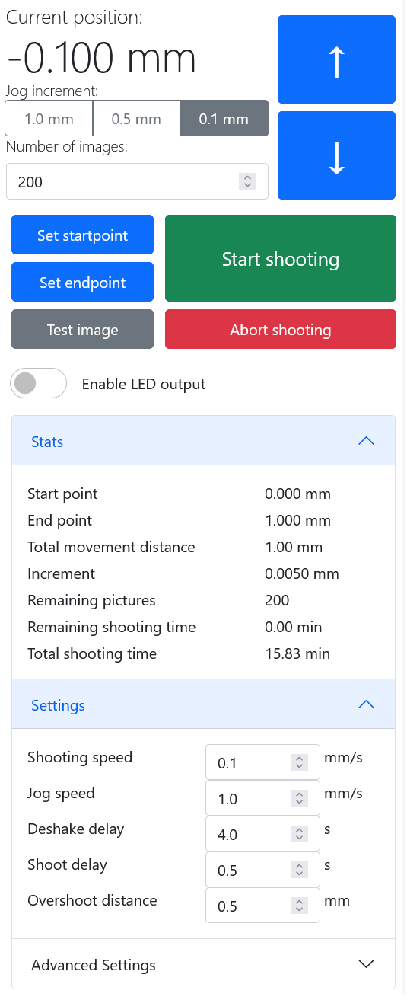

# OpenMacroRail Firmware and Web-interface
## Summary
The OpenMacroRail Firmware provides a web-interface for accurately moving a camera in small increments in order to do focus stacking. The OpenMacroRail project also consists of a [DIY-friendly circuit-board design](https://github.com/AppliedProcrastination/Motorized-Macro-Rail) that can be manufactured for around $30 if you have access to a soldering iron. The circuit board is designed for photographers with electronics skills rather than engineers with photography skills. In addition, some external hardware is also required (like a macro slider, a motor, and a camera). 

Already have the hardware? [Get started](#getting-started)!

### Other parts of this project:
- [Electronics / printed circuit board](https://github.com/AppliedProcrastination/Motorized-Macro-Rail)
- [3D printable gears and PCB mount](https://www.printables.com/model/219042-motorized-camera-rail-for-macro-photography) 
- [3D printable microscope objective adapter](https://www.printables.com/model/218910-microscope-objective-adapter) (RMS Thread 160mm focal distance)
- [Canon EF/EF-S mount for the microscope adapter above](https://www.printables.com/model/218900-canon-efef-s-lens-mount-with-screw-holes)
- Section of README with links to other relevant documentation: [Various Documentation](#various-documentation)

# Getting Started
## Quick Start
The fastest way to install the OpenMacroRail software on the ESP32 is by going to the [OpenMacroRail online installation website](https://appliedprocrastination.github.io/OpenMacroRail/). This website will enable installing the latest OpenMacroRail firmware-release to your ESP32 directly from the web browser (Chrome, Edge and Opera are supported) without installing any unnecessary software on your computer. 

1. Go to the [OpenMacroRail online installation website](https://appliedprocrastination.github.io/OpenMacroRail/)
1. Follow the instructions there

## Setting up the development environment
The development environment for this project is slightly more involved than a generic Arduino project. Mainly due to being based on the ESP32 microcontroller, which is not officially supported by Arduino themselves. The ESP32 is luckily incredibly popular in its own right, and is well supported in the Arduino ecosystem once everything has been set up correctly. Here is a basic guide for how to get started.
1. Install the Arduino IDE
1. Add ESP32 board manager URL: `https://raw.githubusercontent.com/espressif/arduino-esp32/gh-pages/package_esp32_index.json`
1. Install "esp32 by Espressif Systems" from the Arduino Boards Manager.
1. (Planned in the future. Not currently needed) Install ESP32 filesystem upload plugin for Arduino IDE (SPIFFS = SPI-Flash File System): https://github.com/me-no-dev/arduino-esp32fs-plugin
1. Install the following libraries via the Arduino Library Manager: 
    - WiFiManager (by tzapu) 
    - SpeedyStepper (by S.Reifel)

        Note: The version of SpeedyStepper available in the Arduino Library Manager contains a typo in an import header that stops it from working on Linux. Download directly from the [GitHub repository](https://github.com/Stan-Reifel/SpeedyStepper.git) to fix this error.
1. Build and flash firmware
1. Connect to WiFi Access Point named "OpenMacroRail-AP"
1. Enter your WiFi credentials (these will be stored in EEPROM on the ESP32)
1. Connect to the same network with your mobile phone or computer
1. In a web browser, on your mobile phone or computer, enter the URL `OpenMacroRail.local`
    1. Alternatively: 
    
        Set Baud Rate in Serial Monitor to 115200 and wait for IP Address to show up
    
    1. Type IP address in browser to access the user interface
1. Plug 12V power in the power jack to enable the motor

## Various documentation:
- [NodeMCU-32S Core Development Board](https://docs.ai-thinker.com/en/esp32/boards/nodemcu_32s)
- [NodeMCU Arduino Core (Software)](https://github.com/espressif/arduino-esp32)
- [TMC2209-V1.2 manual (Motor driver module)](https://github.com/bigtreetech/BIGTREETECH-TMC2209-V1.2/blob/master/manual/TMC2209-V1.2-manual.pdf)
- [TMC2209 datasheet (chip itself)](https://www.trinamic.com/fileadmin/assets/Products/ICs_Documents/TMC2209_datasheet_rev1.07.pdf)